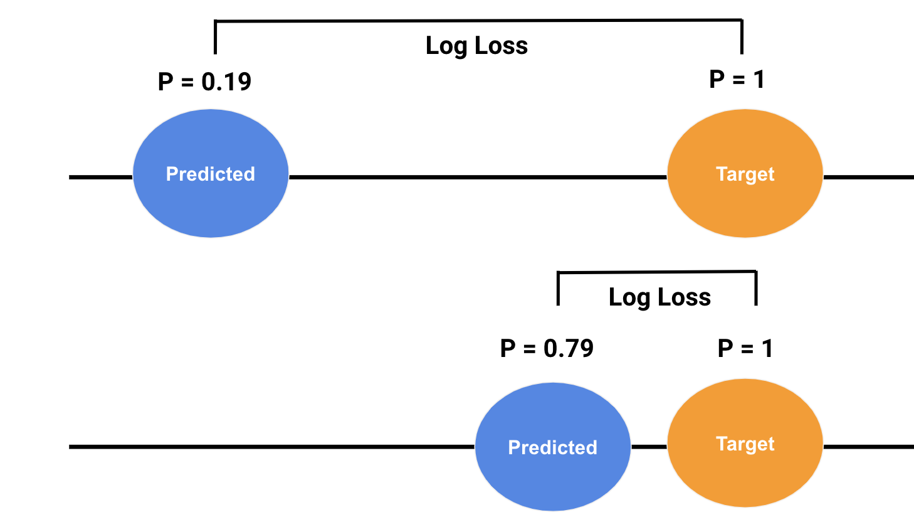
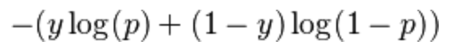

```{r setup, include=FALSE}
knitr::opts_chunk$set(echo = TRUE)

directory <- "/Users/emily.webber/Dropbox/Website Dropbox 2/LogLoss"
setwd(directory)

library(data.table)
library(knitr)
library(dplyr)
library(stringr)
library(data.table)
library(ggplot2)
library(gridExtra)


#Get Train Set Ready **********
Boat <- read.csv("train.csv")
Boat3 <- Boat


#Feature Engineering ****************


#Other variable cleaning and imputing
Boat3$Embarked[Boat3$Embarked == ""] <- "C"
Boat3$Ticket <- NULL
Boat3$lastName <- NULL
TrainID <- Boat3$PassengerId
Boat3$Name <- NULL
Boat3$PassengerId <- NULL

Boat3$Age[is.na(Boat3$Age)] <- median(Boat3$Age, na.rm = TRUE)


#Deck and Cabin Imputation
Boat3$Cabin <- NULL
Boat3$Survived <- as.factor(Boat3$Survived)
Boat4 <- Boat3
#Save Set for Demimished model


#RandomForest******************

library(randomForest)

set.seed(42)


#Good*********


RF <- randomForest(Survived ~., 
                       Boat3,
                       mtyr = 10,
                       ntree = 10000)

RF

vote_RF <- RF$votes
x <- vote_RF[, 2]
x2 <- as.data.frame(x)
x2 <- unlist(x2)

Boat3$Pred <- as.numeric(x2)


#Not Good******

#Dropped Columns + Noise


noise <- rbinom(891,10,0.1)    
noise2 <- rbinom(891,10,0.1)    
noise3 <- rbinom(891,10000,0.1)   

Boat4$noise <- noise
Boat4$noise2 <- noise2
Boat4$noise3 <- noise3

Boat4$Sex <- NULL
Boat4$Pclass <- NULL

RF_Bad <- randomForest(Survived ~., 
                   Boat4,
                   mtyr = 10,
                   ntree = 1000)

RF_Bad

vote_RF_Bad <- RF_Bad$votes
y <- vote_RF_Bad[, 2]
y2 <- as.data.frame(y)
y2 <- unlist(y2)

Boat4$Pred <- as.numeric(y2)


#LogLoss***************************
library(Metrics)
#library(MLMetrics)

LL1 <- Boat3[, c(1, 9)]

#Deal with Infinity situation

LL1$Pred[LL1$Pred == 0 & LL1$Survived == 1] <- 0.0000000001

LL2 <- Boat4[, c(1, 10)]

LL1$Survived <- as.numeric(LL1$Survived)
LL2$Survived <- as.numeric(LL2$Survived)

LL1$Survived2 = LL1$Survived - 1
LL2$Survived2 = LL2$Survived - 1

LogLoss_Best <- ll(LL1$Survived2, LL1$Pred)
LL1$LogLoss <- LogLoss_Best

LL2 <- as.data.frame(LL2)
LogLoss_Worst <- ll(LL2$Survived2, LL2$Pred)


#Check the means of each log loss
mean(LogLoss_Best)
mean(LogLoss_Worst)

sd(LogLoss_Best)
sd(LogLoss_Worst)

median(LogLoss_Best)
median(LogLoss_Worst)

max(LogLoss_Best)
max(LogLoss_Worst)


```


&nbsp;
&nbsp;
&nbsp;

**What is LogLoss?**

LogLoss is an error calculation used to determine how close the predictions of a model are to the actual values. 

**When could you use it?** 

LogLoss can used for classification models that output a probability score. 

**Should it be big or small?**

The goal is to reduce LogLoss when using it as a measure of model performance.  A model that perfectly predicts probabilities would have a LogLoss of 0. 

**Why would you use this instead of AUC?**

Unlike AUC, LogLoss is robust in the presence of imbalanced classes. It takes into account the certainty of the prediction.  

**Wait....how can accuracy be inaccurate?**

When the target class has a large imbalance, for example 1% of the target class, then this can make accuracy dubious to interpret. 

For example, let's say you have a dataset with 10,000 rows and only 100 are the target.  Then you could technically classify the whole set as "not the target" and get an AUC of 99% - which while technically correct, isn't very useful. 

There are other ways to get around this like precision, recall and their harmonic mean (F1 score), but LogLoss is a more direct measure of what you are attempting to achieve - accurate probabilities.


&nbsp;
&nbsp;
&nbsp;


### What does LogLoss really measure?

Below you can see a representation of predicted and actual probabilities.  

  The top example depicts a poor prediction, where there is a large difference between the predicted and actual, this is results in a large LogLoss.  This is good because the function is penalizing a wrong answer that the model is "confident" about. 

  Conversely, the bottom example shows a good prediction that is close to the actual probability.  This results in a low LogLoss, which is good because the model is rewarding a correct answer that the model is "confident" about.
  
```{r echo=FALSE, fig.cap="", out.width = '70%', fig.align = 'center'}



```

### Formula
 Below is the formula for LogLoss from wikipedia.  It is calculated for every observation in the dataset and then averaged. 
 


 
```{r  echo=FALSE, fig.cap="", out.width = '40%', fig.align = 'center'}



 

```

### Simple right?

So, this all seems neat and simple.  However, when I learned about it I became curious about two questions: 

1. What does the distribution of LogLoss look like?
&nbsp;
&nbsp; 


2. Why do we take the mean?  Is that really the right choice?
&nbsp;
&nbsp; 

&nbsp;
&nbsp; 


## Experiment 1:  What does the distribution of LogLoss look like?
&nbsp;
&nbsp; 


I decided to look into it by creating two models (one good, one bad) on a famous data science dataset called the [Titanic dataset](https://www.kaggle.com/c/titanic/data).

Specifically, I wanted to see what the distributions looked like for a good and poor predictive model. 

You can find all of the code I used to create these models on my [Github site](https://github.com/emilyswebber), the modeling itself will not be the focus of this posting.  

**General characteristics of the two models.**  

* I used random forests to create both of the models.
* The "Good" model had engineered features and lots of trees.
* The "Poor" model had reduced features and some noise columns added in.
&nbsp;
&nbsp;


**Good Model stats**
```{r fig.width= 10, fig.height = 6, echo = FALSE, warning = FALSE, comment=FALSE}

RF
```


**Poor Model stats**
```{r fig.width= 10, fig.height = 6, echo = FALSE, warning = FALSE, comment=FALSE}

RF_Bad
```

*You can see the OOB error rate is almost twice as high in "Poor" model.*

&nbsp;
&nbsp; 


### Distributions 

&nbsp;
First I wanted to see the predicted probability distributions for the two hypothetical models. 

&nbsp;
&nbsp; 


**Probabilities**
&nbsp;
&nbsp; 


```{r fig.width= 12,  fig.height = 5, echo = FALSE, warning = FALSE, fig.show='hold', fig.align='center', comment=FALSE}


LL1$Survive[LL1$Survived2 == 0] <- "No"
LL1$Survive[LL1$Survived2 == 1] <- "Yes"

LL1P <- ggplot(aes(x=Pred, fill=Survive), data=LL1, stat_bin(25)) + 
  geom_histogram(bins = 25) +   
  scale_fill_manual(values = c("dark gray","dark blue")) +
  ggtitle("Good Model")  + 
   ylab("Count") + 
   xlab('Pred Probabilities') + theme(legend.position="top")

LL2$Survive[LL2$Survived2 == 0] <- 'No'
LL2$Survive[LL2$Survived2 == 1] <- "Yes"

LL2P <- ggplot(aes(x=Pred, fill=Survive), data=LL2, stat_bin(25)) + 
  geom_histogram(bins = 25) +
  scale_fill_manual(values = c("dark gray","dark blue")) +
  ggtitle("Poor Model")  + 
   ylab("Count") + 
   xlab('Pred Probabilities')+ theme(legend.position="top")


grid.arrange(LL1P, LL2P, ncol = 2)

```
&nbsp;
&nbsp; 


Then I wanted to plot the actual LogLoss distributions for the "Good" and "Poor" models.
&nbsp;
&nbsp; 


**LogLoss**
&nbsp;
&nbsp; 


```{r fig.width= 12,  fig.height = 5, echo = FALSE, warning = FALSE, fig.show='hold', fig.align='center', comment=FALSE}


LL1$Survive[LL1$Survived2 == 0] <- "No"
LL1$Survive[LL1$Survived2 == 1] <- "Yes"
LL1$LogLoss <- LogLoss_Best

LL1P <- ggplot(aes(x=LogLoss, fill=Survive), data=LL1, stat_bin(25)) + 
  geom_histogram(bins = 25) +   
  scale_fill_manual(values = c("dark gray","dark blue")) +
  ggtitle("Good Model")  + 
   ylab("Count") + 
   xlab('LogLoss') + theme(legend.position="top")

LL2$Survive[LL2$Survived2 == 0] <- 'No'
LL2$Survive[LL2$Survived2 == 1] <- "Yes"
LL2$LogLoss <- LogLoss_Worst
LL2P <- ggplot(aes(x=LogLoss, fill=Survive), data=LL2, stat_bin(25)) + 
  geom_histogram(bins = 25) +
  scale_fill_manual(values = c("dark gray","dark blue")) +
  ggtitle("Poor Model")  + 
   ylab("Count") + 
   xlab('LogLoss')+ theme(legend.position="top")


grid.arrange(LL1P, LL2P, ncol = 2)

```


&nbsp;
&nbsp; 


## Experiment 2: What's in an average?
&nbsp;
&nbsp; 


The distributions for the "Good" and "Poor" LogLoss are both skewed, which makes sense when you look back at the formula.

&nbsp;
&nbsp; 


**If it isn't a normal distribution, then why use the average at all?** 

&nbsp;
&nbsp; 


Before we get carried away, let's do the math for the mean, standard deviation and median.
&nbsp;
&nbsp; 


```{r fig.width= 5,  fig.height = 3, echo = FALSE, warning = FALSE,  fig.align='center', comment=FALSE}

LL1Mean <- mean(LL1$LogLoss)
LL1SD <- sd(LL1$LogLoss)
LL2Mean <- mean(LL2$LogLoss)
LL2SD <- sd(LL2$LogLoss)
LL1Med <- median(LL1$LogLoss)
LL2Med <- median(LL2$LogLoss)


MSD <- c(LL1Mean, LL2Mean)
MSD2 <- as.data.frame(MSD)
MSD2$Model <- c('Good', 'Poor')

SSD <- c(LL1SD, LL2SD)
SSD2 <- as.data.frame(SSD)
SSD2$Model <- c('Good', 'Poor')

Med <- c(LL1Med, LL2Med)
Med2 <- as.data.frame(Med)
Med2$Model <- c('Good', 'Poor')

MSD2$SD <- SSD2$SSD
MSD2$Median <- Med2[, 1]
MSD3 <- MSD2[c(2,1,3,4)]

colnames(MSD3)[colnames(MSD3)=="MSD"] <- "Mean"

kable(MSD3)


```
&nbsp;
&nbsp; 

You can see above that the standard deviation (or spread) of the LogLoss is greater than the mean in the "Good" model and almost as large as the mean in the "Poor" model.  This - combined with the shape of the distributions tells me that the mean may not be the best representation of LogLoss. 

If you look at the last column, **Median**, these values appear to represent the distributions better. 

&nbsp;
&nbsp; 
&nbsp;
&nbsp; 


## Experiment 3: What about calculating LogLoss for each class?

&nbsp;
&nbsp; 

The last two analyses lead me to ask another question.

&nbsp; 

3. Can we get median LogLoss for each class for each model and use them for comparison?

&nbsp; 


```{r fig.width= 5,  fig.height = 3, echo = FALSE, warning = FALSE,  fig.align='center', comment=FALSE}

x <- setDT(LL1)[, lapply(.SD, median), by=.(Survive), 
                .SDcols=c("LogLoss")]


y <- setDT(LL2)[, lapply(.SD, median), by=.(Survive), 
                .SDcols=c("LogLoss")]

colnames(x)[colnames(x)=="LogLoss"] <- "Good_LogLoss"
colnames(y)[colnames(y)=="LogLoss"] <- "Poor_LogLoss"


x$Poor_LogLoss <- y$Poor_LogLoss

x$Perc_Diff_LogLoss <- abs(x$Good_LogLoss - x$Poor_LogLoss)/ 
  (x$Good_LogLoss + x$Poor_LogLoss)

kable(x)
```


&nbsp;
&nbsp; 

**It turns out that you can do that.  The "Good" model had a better LogLoss for both the minority and majority class. This is a viable way to compare model performance in classification problems, and should be used over techniques like AUC. **

&nbsp;
&nbsp; 


### Conclusions
&nbsp;
&nbsp; 
1. LogLoss is neat!
&nbsp;
&nbsp; 

2. LogLoss reflects performance of "Good" vs. "Poor" models.
&nbsp;
&nbsp; 

3. The median may be a better choice than the average. 
&nbsp;
&nbsp; 

4. You can segment LogLoss down even further to look at the target and non-target class. This can tell you if the model is succeeding or failing at predicting one of the variable classes.

&nbsp;
&nbsp; 

### Thank you for reading!


<!--html_preserve-->

<link rel="stylesheet" href="style.css" type="text/css" />
<script>
  (function(i,s,o,g,r,a,m){i['GoogleAnalyticsObject']=r;i[r]=i[r]||function(){
  (i[r].q=i[r].q||[]).push(arguments)},i[r].l=1*new Date();a=s.createElement(o),
  m=s.getElementsByTagName(o)[0];a.async=1;a.src=g;m.parentNode.insertBefore(a,m)
  })(window,document,'script','https://www.google-analytics.com/analytics.js','ga');

  ga('create', 'UA-91308049-1', 'auto');
  ga('send', 'pageview');

</script>


<!-- Go to www.addthis.com/dashboard to customize your tools --> <script type="text/javascript" src="//s7.addthis.com/js/300/addthis_widget.js#pubid=ra-589036a8549be1ce"></script>


<!--/html_preserve-->

